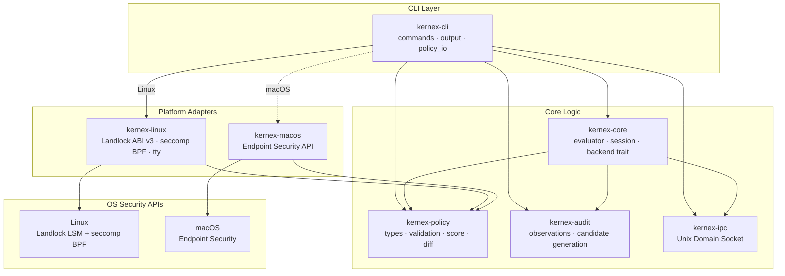

# Kernex

**The zero-trust execution environment for the agentic era.**

[](https://www.rust-lang.org)
[](https://opensource.org/licenses/MIT)
[](#supported-platforms)

Kernex is a high-performance, single-binary Rust hypervisor that uses OS-level kernel APIs to strictly sandbox local AI agents. It intercepts system calls in real-time, instantly paralyzing an agent if it attempts an unauthorized action.

No heavy VMs. No background daemons. Just a single execution wrapper.

> *Don't trust the model. Trust the kernel.*

---

## The Problem

AI agents are being given autonomous control over local machines, but the operating systems they run on were built for human users — not unpredictable AI models.

**01. Prompt Injection & Hijacking**
If an agent has terminal access and reads a malicious prompt hidden in a downloaded webpage or GitHub issue, it can be tricked into exfiltrating environment variables, deleting files, or stealing AWS credentials.

**02. The "Heavy Sandbox" Problem**
Current solutions rely on spinning up heavy VMs or Docker containers to trap the AI. This destroys the native developer experience, consumes massive RAM, and prevents agents from interacting seamlessly with the user's actual workspace.

**03. Application-Level Blindness**
Restricting an agent using Python logic or framework-level constraints is fundamentally flawed. A hallucinating model can simply rewrite the Python script to bypass the restrictions. Security must live below the agent.

---

## The Product

Kernex enforces boundaries at the operating system level. Do not change your code. Do not boot up a VM. Just prefix your run command.

```bash
# Before
python my_agent.py

# After — fully sandboxed at the OS level
kernex run -- python my_agent.py
```

Works with any framework, any language, and any local agent: Claude Code, AutoGen, CrewAI, or custom scripts.

---

## Core Features

- **Zero-Install Wrapper:** A single, statically compiled Rust binary. It wraps the target process and dynamically injects OS-level restrictions before the agent boots.
- **Auto-Profiling (Audit Mode):** Run an agent once with `kernex audit`. Kernex silently observes its behavior and automatically generates a least-privilege `kernex.yaml` policy tailored to that session.
- **JIT Interception:** Strict rules should not crash unpredictable agents. If an agent hits a boundary, Kernex pauses the system call and prompts the user for permission via the terminal.
- **Privilege Separation:** The CLI runs entirely in user-space. It communicates with the core security engine via a restricted Unix Domain Socket (IPC), mathematically eliminating the risk of privilege escalation.

---

## Quick Start

### Installation

```bash
curl -fsSL https://kernex.sh/install | bash
```

*(Downloads the `kernex` binary to `/usr/local/bin`. No other dependencies required.)*

### Step 1 — Audit Mode (First Run)

To run a new agent safely while mapping its required dependencies, use audit mode:

```bash
kernex audit -- python my_agent.py
```

Kernex observes every file read/write and network request, generating a `kernex.yaml` configuration file in your current directory when the process exits.

### Step 2 — Strict Mode (Daily Driving)

```bash
kernex run -- python my_agent.py
```

The agent is now completely sandboxed. Any attempt to access a path, IP, or environment variable not explicitly whitelisted in `kernex.yaml` is instantly blocked at the kernel level.

---

## Configuration (`kernex.yaml`)

```yaml
version: 1
agent_name: "my-coding-agent"

filesystem:
  allow_read:
    - "./src"
    - "./data"
  allow_write:
    - "./output"
  block_hidden: true  # Automatically blocks all .* directories (e.g., .ssh, .aws)

network:
  allow_outbound:
    - host: api.openai.com
      port: 443
    - host: api.anthropic.com
      port: 443
      max_requests_per_minute: 60
  block_all_other: true

environment:
  allow_read:
    - "OPENAI_API_KEY"
    - "ANTHROPIC_API_KEY"
  block_all_other: true  # Prevents the agent from dumping system environment variables
```

---

## MCP Server Co-Sandboxing

When `--mcp` is passed, Kernex applies independent sandbox policies to each MCP server declared in `kernex.yaml`. Each server gets its own filesystem and network boundary — separate from the agent's policy.

```yaml
agent_name: claude-code-agent

filesystem:
  allow_read:
    - ./src
    - ./data
  allow_write:
    - ./output
  block_hidden: true

network:
  allow_outbound:
    - host: api.anthropic.com
      port: 443
      max_requests_per_minute: 60
  block_all_other: true

environment:
  allow_read:
    - ANTHROPIC_API_KEY
  block_all_other: true

mcp_servers:
  - name: filesystem-server
    transport: stdio
    policy:
      filesystem:
        allow_read:
          - ./workspace
        block_hidden: true
      network:
        block_all_other: true

  - name: web-search-server
    transport: http
    endpoint: https://search.example.com/mcp
    policy:
      filesystem:
        block_hidden: true
      network:
        allow_outbound:
          - host: search.example.com
            port: 443
        block_all_other: true
```

---

## Architecture

Kernex is structured as a Rust workspace of focused crates. Each layer has a single responsibility and communicates only through typed interfaces.



If an agent hits a boundary, the blocked action is surfaced as a **JIT terminal prompt** — the agent is paused, not crashed.

---

## Supported Platforms

| Platform | Technology | Minimum kernel / OS | Full features at | Status | How it works |
| --- | --- | --- | --- | --- | --- |
| **Linux** | Landlock LSM + seccomp BPF | Linux 5.13 (Landlock v1) | Linux 5.19 (Landlock v3, truncate support) | Stable | Unprivileged inheritance. Kernex builds a Landlock ruleset, installs a seccomp BPF filter, then calls `landlock_restrict_self()` before `execve()`. Restrictions are inherited by the child. Gracefully degrades to seccomp-only on kernels < 5.13. |
| **macOS** | Endpoint Security | macOS 10.15 Catalina | — | Beta | Kernex registers with the macOS kernel via `endpoint-sec` to receive `AUTH` events for the agent's PID, approving or denying I/O in real-time. |
| **Windows** | ETW / Minifilter | — | — | Unsupported | We advise running Linux agents via WSL2, which is fully supported by Kernex Linux. |

---

## Kernex vs. Traditional Isolation

| Feature | Kernex (Rust native) | Docker | MicroVMs (Firecracker) |
| --- | --- | --- | --- |
| **Boot Time** | < 2ms | ~500ms | ~150ms |
| **RAM Overhead** | ~15MB | High | High |
| **Native Workspace Access** | Seamless | Requires volume mapping | Requires complex 9P mounts |
| **OS-Level Enforcement** | Yes | No | No |

---

## Contributing

Kernex is open-source infrastructure for the agentic ecosystem. We welcome contributions from Rust developers interested in low-level OS security, Landlock, and macOS Endpoint Security.

1. Fork the repository
2. Create your feature branch (`git checkout -b feature/kernel-hook`)
3. Commit your changes (`git commit -m 'Add kernel hook'`)
4. Push to the branch (`git push origin feature/kernel-hook`)
5. Open a Pull Request

For commercial inquiries, telemetry dashboard access, or enterprise SDK licensing, visit [maximlabs.co](https://maximlabs.co).

---

*Built by [Maximlabs.co](https://maximlabs.co)*
